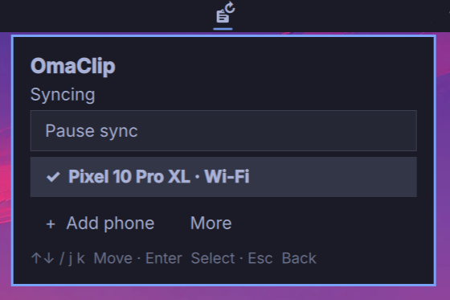

# OmaClip

OmaClip provides a seamless, reliable shared clipboard between Omarchy and one
Android phone over USB or Wi-Fi. No mirroring window, video, or audio—just
keyboard-first clipboard controls in the bar.



## Install

Install the runtime dependencies, enable Wi-Fi discovery, then add and enable
OmaClip:

```sh
omarchy pkg add scrcpy android-tools avahi qrencode
sudo systemctl enable --now avahi-daemon
omarchy plugin add https://github.com/podkovyrin/omaclip.git --enable
~/.config/omarchy/plugins/local.omaclip.clipboard-sync/bin/check-deps
```

The repository includes a prebuilt x86-64 native executable, so a normal install
does not require Rust or a compiler. `omarchy plugin update
local.omaclip.clipboard-sync` updates the executable together with the plugin.

## Android setup

No Android app is required. First enable **Developer options** on the phone: open
**Settings → About phone** and tap **Build number** seven times. The exact menu
names can vary by manufacturer.

For USB:

1. In **Developer options**, turn on **USB debugging**.
2. Connect the unlocked phone to the computer with a data-capable USB cable.
3. Accept the **Allow USB debugging** prompt on the phone.
4. Select the phone in OmaClip and resume sync.

For Wi-Fi (Android 11 or newer):

1. Put the phone and computer on the same local network.
2. Open **Developer options → Wireless debugging** and turn it on.
3. In OmaClip, choose **Add phone → Show QR code**.
4. On Android, choose **Pair device with QR code** and scan the code within two
   minutes.
5. Select the phone in OmaClip and resume sync. If it does not connect
   automatically, enter the main **IP address & port** shown on Android's
   **Wireless debugging** screen—not the temporary pairing port.

## Requirements

- Omarchy with the built-in Quickshell bar and service/bar-widget plugin API.
- An x86-64 system.
- A Wayland session with `wlr-data-control` (Omarchy's Hyprland provides it).
- **scrcpy 4.1**, `android-tools`, `avahi`, and `qrencode`.
- Android with USB debugging enabled; Android 11+ for Wi-Fi pairing.
- Rust 1.88+ and a C toolchain only when building from source.

Runtime dependencies and Wi-Fi discovery can be prepared separately with:

```sh
omarchy pkg add scrcpy android-tools avahi qrencode
sudo systemctl enable --now avahi-daemon
```

OmaClip uses `/usr/share/scrcpy/scrcpy-server` from the system scrcpy package.
It does not download or bundle scrcpy. This release supports **4.1 only** because
scrcpy's control protocol is version-specific; other versions are rejected.
Package updates to a new scrcpy version may require an OmaClip update.

The commands above and `bin/check-deps` handle those requirements explicitly.

## Build and package

From the source directory:

```sh
./bin/build
./bin/check-deps
./bin/package
```

The release archive in `dist/` contains the same prebuilt native executable, UI,
documentation, and dependency checker. It is specific to the architecture on
which it was built.
To install a release archive, extract it into
`~/.config/omarchy/plugins/local.omaclip.clipboard-sync/`, then run:

```sh
~/.config/omarchy/plugins/local.omaclip.clipboard-sync/bin/check-deps
omarchy plugin validate ~/.config/omarchy/plugins/local.omaclip.clipboard-sync
omarchy plugin enable local.omaclip.clipboard-sync
```

When upgrading an older development copy, remove its obsolete `vendor/` folder
and `bin/fetch-server`. If the shell keeps showing cached UI after an update,
run `omarchy restart shell`. Reopen the panel afterwards; if sync was enabled,
OmaClip resumes it automatically.

## Use

Connect and authorize the phone, choose it in OmaClip, then resume sync.
For Wi-Fi, choose **Add phone** and follow the QR pairing instructions.
**More** contains manual connection, refresh, disconnect, and service restart.

Use **↑/↓** or **j/k** to move, **Tab/Shift+Tab** to cycle controls, and
**Enter/Space** to activate. **Escape** closes an expanded section, then the panel.
Right-click the bar icon to pause or resume. A keyboard binding can open it with:

```sh
omarchy-shell local.omaclip.clipboard-sync toggle
```

Only new UTF-8 text copies up to 65,536 bytes are shared. Connecting or resuming
preserves both existing clipboards. The enabled or paused choice is saved: an
enabled session resumes automatically after a service restart or temporary
failure, while a session explicitly paused by the user remains paused. Pause
sync before copying sensitive text that should not be shared with the phone.
Close scrcpy or Android Mirror before syncing; OmaClip avoids competing sessions.

## Development

```sh
cargo fmt --check
cargo test --locked
cargo clippy --locked --all-targets -- -D warnings
./bin/check-ui
omarchy plugin validate .
```

The UI checks need Omarchy, Quickshell, and QtTest. They cover keyboard activation,
focus after device updates, pairing cancellation, and narrow layouts. Rendered
previews are saved under `/tmp/omaclip-ui-check/`. Runtime dependency checks are
separate from compilation, so builds and tests do not need a connected phone.

MIT licensed. See [NOTICE](NOTICE) for third-party attribution and
[CHANGELOG.md](CHANGELOG.md) for release notes.
